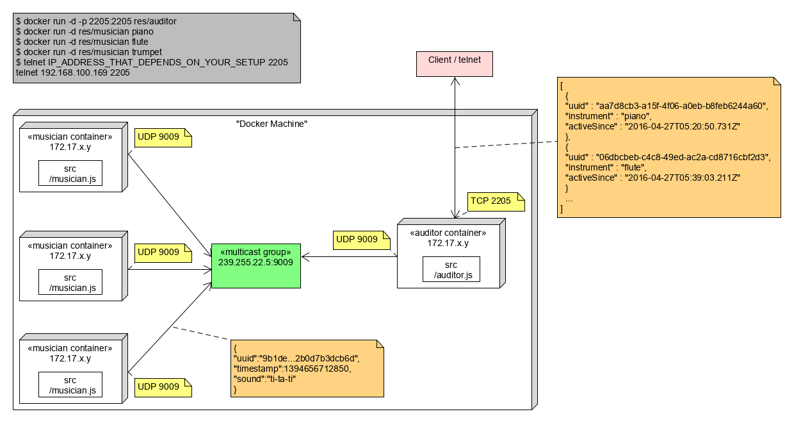

# Teaching-HEIGVD-RES-2020-Labo-Orchestra

## Admin

* **You can work in groups of 2 students**.
* It is up to you if you want to fork this repo, or if you prefer to work in a private repo. However, you have to **use exactly the same directory structure for the validation procedure to work**. 
* We expect that you will have more issues and questions than with other labs (because we have a left some questions open on purpose). Please ask your questions on Telegram / Teams, so that everyone in the class can benefit from the discussion.

## Objectives

This lab has 4 objectives:

* The first objective is to **design and implement a simple application protocol on top of UDP**. It will be very similar to the protocol presented during the lecture (where thermometers were publishing temperature events in a multicast group and where a station was listening for these events).

* The second objective is to get familiar with several tools from **the JavaScript ecosystem**. You will implement two simple **Node.js** applications. You will also have to search for and use a couple of **npm modules** (i.e. third-party libraries).

* The third objective is to continue practicing with **Docker**. You will have to create 2 Docker images (they will be very similar to the images presented in class). You will then have to run multiple containers based on these images.

* Last but not least, the fourth objective is to **work with a bit less upfront guidance**, as compared with previous labs. This time, we do not provide a complete webcast to get you started, because we want you to search for information (this is a very important skill that we will increasingly train). Don't worry, we have prepared a fairly detailed list of tasks that will put you on the right track. If you feel a bit overwhelmed at the beginning, make sure to read this document carefully and to find answers to the questions asked in the tables. You will see that the whole thing will become more and more approachable.


## Requirements

In this lab, you will **write 2 small NodeJS applications** and **package them in Docker images**:

* the first app, **Musician**, simulates someone who plays an instrument in an orchestra. When the app is started, it is assigned an instrument (piano, flute, etc.). As long as it is running, every second it will emit a sound (well... simulate the emission of a sound: we are talking about a communication protocol). Of course, the sound depends on the instrument.

* the second app, **Auditor**, simulates someone who listens to the orchestra. This application has two responsibilities. Firstly, it must listen to Musicians and keep track of **active** musicians. A musician is active if it has played a sound during the last 5 seconds. Secondly, it must make this information available to you. Concretely, this means that it should implement a very simple TCP-based protocol.


### Instruments and sounds

The following table gives you the mapping between instruments and sounds. Please **use exactly the same string values** in your code, so that validation procedures can work.

| Instrument | Sound         |
|------------|---------------|
| `piano`    | `ti-ta-ti`    |
| `trumpet`  | `pouet`       |
| `flute`    | `trulu`       |
| `violin`   | `gzi-gzi`     |
| `drum`     | `boum-boum`   |

### TCP-based protocol to be implemented by the Auditor application

* The auditor should include a TCP server and accept connection requests on port 2205.
* After accepting a connection request, the auditor must send a JSON payload containing the list of <u>active</u> musicians, with the following format (it can be a single line, without indentation):

```
[
  {
  	"uuid" : "aa7d8cb3-a15f-4f06-a0eb-b8feb6244a60",
  	"instrument" : "piano",
  	"activeSince" : "2016-04-27T05:20:50.731Z"
  },
  {
  	"uuid" : "06dbcbeb-c4c8-49ed-ac2a-cd8716cbf2d3",
  	"instrument" : "flute",
  	"activeSince" : "2016-04-27T05:39:03.211Z"
  }
]
```

### What you should be able to do at the end of the lab


You should be able to start an **Auditor** container with the following command:

```
$ docker run -d -p 2205:2205 res/auditor
```

You should be able to connect to your **Auditor** container over TCP and see that there is no active musician.

```
$ telnet IP_ADDRESS_THAT_DEPENDS_ON_YOUR_SETUP 2205
[]
```

You should then be able to start a first **Musician** container with the following command:

```
$ docker run -d res/musician piano
```

After this, you should be able to verify two points. Firstly, if you connect to the TCP interface of your **Auditor** container, you should see that there is now one active musician (you should receive a JSON array with a single element). Secondly, you should be able to use `tcpdump` to monitor the UDP datagrams generated by the **Musician** container.

You should then be able to kill the **Musician** container, wait 5 seconds and connect to the TCP interface of the **Auditor** container. You should see that there is now no active musician (empty array).

You should then be able to start several **Musician** containers with the following commands:

```
$ docker run -d res/musician piano
$ docker run -d res/musician flute
$ docker run -d res/musician flute
$ docker run -d res/musician drum
```
When you connect to the TCP interface of the **Auditor**, you should receive an array of musicians that corresponds to your commands. You should also use `tcpdump` to monitor the UDP trafic in your system.


## Task 1: design the application architecture and protocols

| #  | Topic |
| --- | --- |
|Question | How can we represent the system in an **architecture diagram**, which gives information both about the Docker containers, the communication protocols and the commands? |
| |  |
|Question | Who is going to **send UDP datagrams** and **when**? |
| | Chaque conteneur musicien envoie des datagrammes UDP toutes les secondes. |
|Question | Who is going to **listen for UDP datagrams** and what should happen when a datagram is received? |
| | Chaque conteneur auditeur écoute les datagrammes reçus et ajoute le musicien à la map si c'est le premier datagramme reçu ou met à jour la date de dernière activité du musicien dans la map. |
|Question | What **payload** should we put in the UDP datagrams? |
| | L'uuid qui permet d'identifier le musicien et le timestamp de la dernière note jouée sont deux informations obligatoires. Ici, le son de l'instrument est aussi présent. |
|Question | What **data structures** do we need in the UDP sender and receiver? When will we update these data structures? When will we query these data structures? |
|  | Musicien : un dictionnaire implémenté avec une map permet d'associer à chaque instrument le son produit<br />Auditeur : une map qui contient les musiciens actifs identifiés avec une clé qui est l'uuid du musicien. L'information de dernière activité est notemment stockée dans la valeur. |


## Task 2: implement a "musician" Node.js application

| #  | Topic |
| ---  | --- |
|Question | In a JavaScript program, if we have an object, how can we **serialize it in JSON**? |
| | `JSON.stringify()` |
|Question | What is **npm**?  |
| | C'est le gestionnaire de packet de Node JS |
|Question | What is the `npm install` command and what is the purpose of the `--save` flag?  |
| | Cette commande permet d'installer un package dans le projet JavaScript. L'ensemble des packages sont stockés dans le dossier `node_modules`. La configuration des packages référencés dans le projet sont disponible dans le fichier `package.json`. <br />Le flag `--save` permet de garder la dépendance localement sur l'ordinateur. |
|Question | How can we use the `https://www.npmjs.com/` web site?  |
| | Ce site permet de rechercher des packages en fonction des besoins. |
|Question | In JavaScript, how can we **generate a UUID** compliant with RFC4122? |
| | Nous avons utilisé le package [uuid](https://www.npmjs.com/package/uuid). Il a été installé via `npm`. |
|Question | In Node.js, how can we execute a function on a **periodic** basis? |
|  | `setInterval(function, interval)` *function* est une fonction de callback qui est exécutée toutes les *interval* millisecondes. |
|Question | In Node.js, how can we **emit UDP datagrams**? |
| | En utilisant la librairie standrad Node JS `dgram`. Les datagrammes sont envoyés en utilisant la méthode `socket.send()`. |
|Question | In Node.js, how can we **access the command line arguments**? |
| | `process.argv[i]` où i est l'index de l'argument. |


## Task 3: package the "musician" app in a Docker image

| #  | Topic |
| ---  | --- |
|Question | How do we **define and build our own Docker image**?|
| | Nous sommes partis d'une image Docker avec la version 16 de Node JS :<br />`FROM node:16`<br />Nous avons ensuite copier les sources dans le conteneur :<br />`COPY src /opt/app/`<br />Puis installé les dépendances nécessaires :<br />`WORKDIR /opt/app/`<br/>`RUN npm install`<br />Finalement, nous avons exécuté le script JavaScript :<br />`ENTRYPOINT ["node", "/opt/app/auditor.js"]` |
|Question | How can we use the `ENTRYPOINT` statement in our Dockerfile?  |
|  | La commande `ENTRYPOINT` permet de lancer une commande dans le conteneur lorsque celui-ci est démarré. Nous l'avons utilisée pour lancer l'exécution du script JavaScript dans les conteneurs après installation des dépendances. |
|Question | After building our Docker image, how do we use it to **run containers**?  |
| | `docker run -d res/musician <instrument>` <br />Les instruments suivants sont disponibles : piano, trumpet, flute, violin, drum |
|Question | How do we get the list of all **running containers**?  |
| | `docker ps` |
|Question | How do we **stop/kill** one running container?  |
|  | `docker kill <container>` avec l'id du conteneur à tuer obtenu via`docker ps`. |
|Question | How can we check that our running containers are effectively sending UDP datagrams?  |
| | Pour vérifier l'envoi des datagrammes UDP, on peut utiliser `tcpdump -i docker0`. Cela affiche les packets envoyés sur l'interface `docker0` des conteneurs. |


## Task 4: implement an "auditor" Node.js application

| #  | Topic |
| ---  | ---  |
|Question | With Node.js, how can we listen for UDP datagrams in a multicast group? |
|  | Il faut d'abord créer un socket udp : `const udp = dgram.createSocket("udp4");`<br />Ensuite, il faut l'ajouter dans les membres du groupe multicast UDP : `udp.addMembership(MULTICAST_ADDRESS)`<br />Les datagrammes peuvent être écoutés via : `udp.on("message", function)` |
|Question | How can we use the `Map` built-in object introduced in ECMAScript 6 to implement a **dictionary**?  |
| | Voici comment créer la map de musiciens : `const musicians = new Map();`<br />Les éléments peuvent ensuite être ajoutés dans la map en utilisant  :  `musicians.add(key, value)` |
|Question | How can we use the `Moment.js` npm module to help us with **date manipulations** and formatting?  |
| | Moment JS est une librairie de gestion de dates. Elle a été utilisée pour faciliter le traitement des dates dans nos scripts. L'utilisation la plus évoluée que nous avons faite est la soustraction de secondes au temps courant : `moment().subtract(5, 's').diff(OTHER_TIME)` |
|Question | When and how do we **get rid of inactive players**?  |
| | Les musiciens inacitifs sont supprimés de la map lorsqu'un client TCP demande se connecte et qu'il faut envoyer la liste des membres actifs. C'est à ce moment là que l'on parcourt la map et que l'on supprime les musiciens inactifs via : `musicians.delete(uuid)` |
|Question | How do I implement a **simple TCP server** in Node.js?  |
|  | Nous avons utilisé la librairie standard Node JS `net` :<br />Pour créer le serveur, il faut faire : `const tcp = net.createServer()`<br />Pour écouter sur le serveur les connexions entrantes :  `tcp.on("connection", function)`<br />Et pour démarrer le serveur : `tcp.listen(PORT, ADRESSE_IP)` |


## Task 5: package the "auditor" app in a Docker image

| #  | Topic |
| ---  | --- |
|Question | How do we validate that the whole system works, once we have built our Docker image? |
| | Nous avons d'abord validé les scipts en les exécutants via la commande `node auditor.js` et `node musician.js`.<br />Ensuite nous les avons déposés dans les conteneurs et avons analysé les datagrammes UDP envoyés avec tcpdump.<br />Finalement, nous avons utilisé `telnet` pour nous connecter sur le conteneur et réaliser plusieurs tests afin de nous assurer que tout fonctionnait.<br />Le script `validate.sh` a également permis de valider notre laboratoire. |


## Constraints

Please be careful to adhere to the specifications in this document, and in particular

* the Docker image names
* the names of instruments and their sounds
* the TCP PORT number

Also, we have prepared two directories, where you should place your two `Dockerfile` with their dependent files.

Have a look at the `validate.sh` script located in the top-level directory. This script automates part of the validation process for your implementation (it will gradually be expanded with additional operations and assertions). As soon as you start creating your Docker images (i.e. creating your Dockerfiles), you should try to run it.
